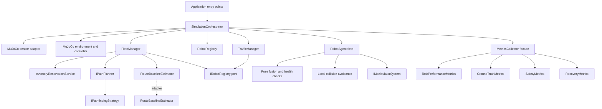
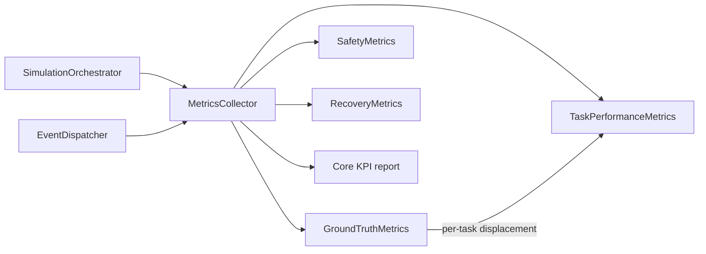
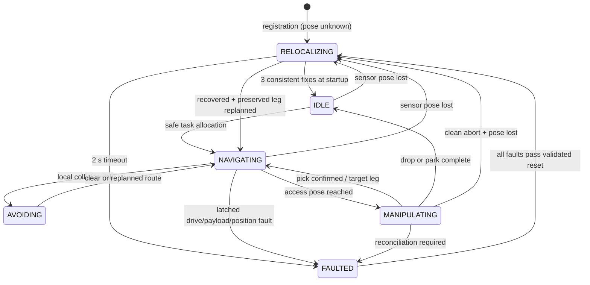
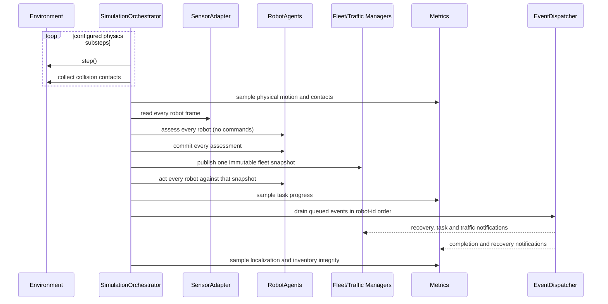

# Autonomous Warehouse Logistics

## Introduction

This project is an autonomous warehouse simulation in MuJoCo for Course 20973. A fleet of holonomic mobile robots uses robotic arms to move cargo through a multi-tier warehouse. The Central Unit assigns tasks and plans shared routes, while each robot handles sensing, localization, local collision avoidance, and immediate safety actions.

## Contents

- [1. Project Requirements](#1-project-requirements)
- [2. System Architecture and Key Components](#2-system-architecture-and-key-components)
- [3. Alternative Approaches](#3-alternative-approaches)
- [4. Simulation Scenarios](#4-description-of-simulation-scenarios)
- [5. Performance Metrics](#5-performance-metrics)
- [6. Preliminary Prototype and Demonstration](#6-preliminary-prototype-and-demonstration)
- [7. Evaluation Criteria](#7-evaluation-criteria)
- [8. Challenges and Risks](#8-challenges-and-risks)
- [9. Timeline and Work Plan](#9-timeline-and-work-plan)

Four onboard, world-aligned rangefinders estimate each robot's continuous `x/y` position from the perimeter walls. A command-based motion model bridges short gaps between valid measurements. Because the chassis uses independent X/Y slide joints rather than wheels, this model is not wheel odometry. Simulator ground truth is reserved for evaluation through `IGroundTruthProbe` and is not available to the control system.

## 1. Project Requirements

### Functional Requirements

- **Task Execution:** Autonomous Mobile Robots (AMRs) must successfully execute a variety of warehouse tasks (STORE, RETRIEVE, RELOCATE, PARK).
- **Collision Avoidance:** Robots must navigate the grid safely without colliding with each other or static obstacles.
- **Traffic Resolution:** The system must recognize pairwise traffic conflicts, stop safely, and apply a suitable wait or reroute strategy. Longer multi-robot dependency cycles must be reported as a known limitation unless a fleet-wide detector is added.
- **Self-Localization:** Each robot must estimate its position from onboard sensors. If the estimate becomes unavailable or unsafe, motion must stop until localization is restored.
- **State Validation and Recovery:** The system must handle displacement, commanded-motion stalls, invalid sensor data, and payload-state mismatches. Recovery policy depends on the task phase and whether the physical inventory state is known.
- **Inventory Management:** Robots must not pick from empty locations or drop into occupied locations. Invalid tasks must be rejected without interrupting the simulation.
- **Multi-Task Allocation:** The Central Unit must assign ready tasks to available robots using collision-free routes.
- **Scalability:** Per-robot processing and route coordination must remain practical as the fleet and task rate increase.

**Technical Requirements:**

- **Programming Language:** The control system must be written in Python.
- **Physics Framework:** The simulation must run on MuJoCo.
- **Architectural Standards:** The codebase must follow SOLID principles and Clean Architecture to separate high-level logic from the MuJoCo API.

### Constraints and Expected Outcomes

- The physical model contains four holonomic robots, multi-tier shelves, one
  inbound dock, one outbound dock, and a bounded rectangular work area.
- Robots must localize from onboard measurements. Simulator position may be
  used for evaluation but not for navigation, manipulation, or safety control.
- Control decisions use simulation time and a deterministic read, assess,
  commit, and act sequence.
- Package identity and inventory reservations must remain consistent through
  successful operations, retries, and fault recovery.
- The expected outcome is a working multi-robot prototype that completes
  storage, retrieval, relocation, and parking while satisfying the safety and
  performance criteria defined below.

## 2. System Architecture and Key Components

The system is divided into concentric layers following Clean Architecture. Dependencies point inward, keeping business logic isolated from MuJoCo. Runtime control uses a deterministic synchronous tick loop. Domain events notify fleet services and metrics after immediate local safety decisions have already been applied.



The composition root constructs the concrete adapters. Application services
depend on ports and domain values. Only Layer 4 knows about MuJoCo.

#### Composition Root and Robot Registry

`build_application()` is the single production composition root. It loads the
model, constructs adapters and use cases, installs traffic strategies, creates
the shared `RobotRegistry`, and registers the configured physical robots.
`main.py` and `visualize.py` only add their scenario or user-interface behavior
without repeating dependency wiring.

`FleetManager` and `TrafficManager` depend on `IRobotRegistry`, whose values
implement the structural `ICoordinatedRobot` port. They never retain or receive
a mutable `Dict[str, RobotAgent]`. The registry is the only owner of the live
agent mapping. Managers read fleet-wide geometry through immutable
`FleetSnapshot` values and use the narrow robot port only for required task,
route, and recovery operations.

Runtime collaborators are required explicitly. Attachment synchronization is
provided through `IAttachmentSynchronizer`. Snapshot updates are normal methods
on the required fleet and traffic coordinators. Control code does not use
`hasattr` or `getattr` to discover capabilities at runtime.

### Layer 1: Entities (Core Data Structures)

These classes are the authoritative domain records. `RobotState` contains the robot's estimated state rather than simulator ground truth. The static warehouse layout is kept separate from dynamic inventory state.

#### WarehouseTopology

**Role:** Describes the warehouse's fixed geometry: bounds, shelves, docks, parking areas, and navigable cells. Routing depends on this abstraction rather than on coordinates embedded in control logic.

**Properties:**

- `grid_width`, `grid_height`: The maximum dimensions of the 2D matrix.
- `min_x`, `max_x`, `min_y`, `max_y`: The inner faces of the perimeter walls in meters. The continuous wall localizer uses these bounds rather than rounded grid cells.
- `zone_map`: A dictionary mapping `(x, y)` coordinates to `ZoneType` values.

**ZoneType Enum**

- `SHELF`: A storage location.
- `PARKING`: A designated idle-robot location.
- `INBOUND_DOCK`: The arrival point for new packages.
- `OUTBOUND_DOCK`: The dispatch point for packages leaving the warehouse.
- `NORMAL_FLOOR`: A navigable floor cell.

**Methods:**

- `is_navigable(x, y)`: Validates if the chassis may occupy a coordinate. Shelves and physical package docks are stations, so the robot stops beside them rather than driving onto them.
- `get_zone_type(x, y)`: Returns the enum zone type for a specific coordinate.
- `get_access_point(target_coords, robot_coords)`: Selects the closest navigable cardinal neighbor of a shelf or dock. Ordinary floor and parking cells remain their own destinations.
- `get_approach_direction(target_coords, access_coords)`: Returns the world direction from the selected access cell toward the payload. The same `CardinalDirection` is passed to the turret controller.
- `is_pose_feasible(pose, footprint_radius_m)`: Checks the continuous robot footprint against bounds and static geometry. Localization may correctly locate a displaced robot inside a shelf. This separate check marks the known pose physically invalid and stops it.

**Structural Sketch:**

```python
class ZoneType(Enum):
    INBOUND_DOCK = auto()
    OUTBOUND_DOCK = auto()
    NORMAL_FLOOR = auto()
    SHELF = auto()
    PARKING = auto()

@dataclass
class WarehouseTopology:
    grid_width: int
    grid_height: int
    min_x: float
    max_x: float
    min_y: float
    max_y: float
    zone_map: Dict[Tuple[int, int], ZoneType]

    def is_navigable(self, x: int, y: int) -> bool:

    def get_zone_type(self, x: int, y: int) -> ZoneType:

    def get_access_point(self, target_coords: Tuple[int, int],
                         robot_coords: Tuple[int, int]) -> Tuple[int, int]:

    def get_approach_direction(self, target_coords: Tuple[int, int],
                               access_coords: Tuple[int, int]) -> CardinalDirection:

    def is_pose_feasible(self, pose: "Pose", footprint_radius_m: float) -> bool:
```

#### Pose

**Role:** An immutable two-dimensional position on the warehouse floor. Immutability prevents a position from changing while it is used in a control decision.

Only `x` and `y` are stored. The robots are holonomic - two independent slide joints and no steering axis - so they have no orientation to track. Heading is derived from the direction of travel purely for display.

**Structural Sketch:**

```python
@dataclass(frozen=True)
class Pose:
    x: float
    y: float

    def distance_to(self, other: "Pose") -> float:
```

#### PoseEstimate

**Role:** Combines a believed position with its uncertainty, source, and timestamp. Consumers use this information to decide whether the estimate is suitable for navigation or manipulation.

**Properties:**

- `pose`: The believed position.
- `uncertainty_m`: Conservative position error bound in meters. Grows during prediction and shrinks only on a validated absolute fix.
- `source`: Which mechanism produced it, for diagnosis and metrics.
- `sim_time`: When it was produced, so staleness can be detected.

**PoseSource Enum**

Which mechanism produced the estimate:

- PREDICTED - short-gap prediction from the last accepted pose and the velocity command the robot issued. It is useful during a brief sensor dropout, but uncertainty grows and it is not independent evidence.
- ABSOLUTE_FIX - continuous position measured from validated wall ranges without using the previous pose.
- FUSED - a wall fix is consistent with the physically reachable envelope. This is the normal steady-state result.

**How `uncertainty_m` is calculated**

It is a conservative scalar bound rather than a covariance matrix. Simulated noise is clipped to its configured maximum, and the bound includes calibrated model and mounting margins. A validated wall fix resets uncertainty to that measured bound. Prediction increases it with commanded distance and time since the last valid fix. Thresholds are calibrated against bounded-noise and occlusion cases.

Collision safety uses uncertainty directly. Required separation includes both chassis radii, a physical margin, both pose uncertainties, and braking distance. A fixed separation threshold is insufficient because safe distance changes with localization uncertainty and stopping distance.

**Structural Sketch:**

```python
class PoseSource(Enum):
    """How an estimate was produced, and therefore how much to trust it."""

    PREDICTED = auto()
    ABSOLUTE_FIX = auto()
    FUSED = auto()

@dataclass(frozen=True)
class PoseEstimate:
    pose: Pose
    uncertainty_m: float
    source: PoseSource
    sim_time: float

@dataclass(frozen=True)
class AbsolutePoseFix:
    pose: Pose
    error_bound_m: float
    residual_m: float
    sim_time: float
```

#### SensorFrame

**Role:** Contains the raw measurements collected for one robot at one simulation time. It is the data-transfer boundary between MuJoCo and the domain layer. Interpretation and fusion occur later.

A `-1.0` range means that the ray produced no hit. The frame preserves that value so the appropriate application service can interpret it.

**Properties:**

- `robot_id`: Which robot was sampled.
- `observed_chassis_velocity`: The actual X/Y slide-joint velocity in m/s. It supports stall diagnosis, but it is not a wheel encoder and is not an independent position source.
- `wall_ranges`: Immutable direction/range pairs for the four wall rangefinders. A range is the distance in meters to the first surface it met, or `-1.0` for no return.
- `payload_range`: Distance from the moving end-effector sensor to whatever sits above it, or `-1.0` if the gripper is empty.
- `sim_time`: The simulation clock at the moment of sampling.
- `sequence`: A monotonically increasing sample number used to reject duplicate or stale frames.

Every numeric reading is validated before use. Missing wall directions, `-1`, NaN, infinity, non-monotonic timestamps, and impossible distances are treated as unavailable rather than as zero-distance measurements. For the payload channel, a healthy `-1` no-hit means EMPTY, while a missing or non-finite reading means UNKNOWN.

**CardinalDirection Enum**

One neutral direction type is shared by route approach logic, turret aiming and the wall sensors. Directions are world-aligned rather than robot-relative, because the chassis cannot rotate.

- POS_X, NEG_X, POS_Y, NEG_Y

**Structural Sketch:**

```python
class CardinalDirection(Enum):
    POS_X = auto()
    NEG_X = auto()
    POS_Y = auto()
    NEG_Y = auto()

@dataclass(frozen=True)
class SensorFrame:
    robot_id: str
    observed_chassis_velocity: Optional[Tuple[float, float]]
    wall_ranges: Tuple[Tuple[CardinalDirection, float], ...]
    payload_range: Optional[float]
    sim_time: float
    sequence: int

    def range_for(self, direction: CardinalDirection) -> Optional[float]:
```

The tuple representation keeps the frame immutable, and construction rejects duplicate directions. Numeric value checks belong to the value type and localizer. Per-robot sequence and timestamp checks occur at the adapter boundary and are repeated by the fusion service before it accepts a frame.

#### RobotObservation

**Role:** Holds interpreted, non-pose observations for one logic tick. Assessment proposes these values without changing `RobotState`. Accepted observations and localization are committed together.

```python
@dataclass(frozen=True)
class RobotObservation:
    observed_chassis_velocity: Optional[Tuple[float, float]]
    payload_sample: Optional[bool]
    payload_present: Optional[bool]
    sample_sim_time: Optional[float]
    sequence: Optional[int]
```

An absent frame produces an all-unknown observation. Collision safety then uses the configured worst-case closing speed instead of reusing stale velocity.

`PayloadPresenceTracker` interprets the raw payload range. It requires a configured number of consecutive near or far readings before returning stable PRESENT or EMPTY. Invalid input returns UNKNOWN without advancing the candidate state. Assessment proposes the next debounce state, and the commit phase applies it. `RobotObservation`, manipulation confirmation, and `PayloadCheck` use the same result. Payload presence does not establish package identity.

#### RobotState

**Role:** Stores the robot's estimated pose, observed payload state, task status, and active faults. A newly registered robot has no trusted pose and cannot accept work until sensor-based initialization succeeds.

The believed pose is replaced only through `apply_estimate`, during the orchestrator's atomic commit phase. Estimation and acting are separate so that every robot sees the same-tick fleet snapshot.

**Properties:**

- `robot_id`: Unique identifier.
- `pose_estimate`: Optional believed position. It is `None` until the first confirmed absolute fix.
- `localization_status`: UNINITIALIZED, TRUSTED, DEGRADED or LOST.
- `observed_chassis_velocity`: Current observed X/Y chassis velocity in m/s, or `None` when the current frame failed.
- `expected_payload_id`: The package the task says the robot should carry, or `None`.
- `payload_present`: Last sensor-confirmed presence (`True`, `False` or `None` when unknown).
- `active_faults`: A set of independent fault codes. Localization, drive and payload faults can coexist instead of overwriting one another.
- `is_busy`: Whether a task is assigned.
- `home_base_coords`: Tuple[int, int].

**Methods:**

- `current_coords`: Read-only property returning the believed `(x, y)`. It is unavailable before initialization, so allocation filters such robots before this property is used.
- `heading`: Read-only property derived from the last direction of travel. Display only.
- `apply_localization(estimate, localization_status)`: Atomically replaces the believed pose/status and validates their legal combination. TRUSTED and DEGRADED require a finite estimate. UNINITIALIZED and LOST expose no navigable estimate. A separately confirmed physically invalid pose stays available for containment under its latched fault, never for navigation.

**LocalizationStatus and FaultCode**

Localization confidence and operational faults are separate dimensions:

- UNINITIALIZED - no confirmed absolute fix, stopped and excluded from allocation.
- TRUSTED - a recent validated absolute fix supports the estimate.
- DEGRADED - temporarily predicting through sensor loss and allowed only while uncertainty remains inside the safety budget.
- LOST - the estimate is unsafe or stale, so drive and manipulation are gated.

Fault codes include DRIVE_STALL, PAYLOAD_MISMATCH, SENSOR_INVALID, STATE_TIMEOUT, MANIPULATOR_FAILURE and POSITION_PHYSICALLY_INVALID. `RobotHealthMonitor` returns findings without forcing them into one mutually exclusive status.

**Structural Sketch:**

```python
class LocalizationStatus(Enum):
    UNINITIALIZED = auto()
    TRUSTED = auto()
    DEGRADED = auto()
    LOST = auto()

class FaultCode(Enum):
    DRIVE_STALL = auto()
    PAYLOAD_MISMATCH = auto()
    SENSOR_INVALID = auto()
    STATE_TIMEOUT = auto()
    MANIPULATOR_FAILURE = auto()
    POSITION_PHYSICALLY_INVALID = auto()

@dataclass
class RobotState:
    robot_id: str
    pose_estimate: Optional[PoseEstimate]
    observed_chassis_velocity: Optional[Tuple[float, float]]
    expected_payload_id: Optional[str]
    payload_present: Optional[bool]
    is_busy: bool
    home_base_coords: Tuple[int, int]
    localization_status: LocalizationStatus = LocalizationStatus.UNINITIALIZED
    active_faults: FrozenSet[FaultCode] = frozenset()

    @property
    def current_coords(self) -> Tuple[float, float]:

    @property
    def heading(self) -> float:

    def apply_localization(self, estimate: Optional[PoseEstimate],
                           status: LocalizationStatus) -> None:
```

#### Events (Data Objects)

**Role:** Base class for notifications emitted by the deterministic tick loop. Events coordinate fleet policy, inventory, and metrics after synchronous safety checks have stopped unsafe commands.

**Properties:**

- `sim_time`: Simulation time supplied by the publisher. Wall time is never used for control, timeout or recovery KPIs.
- `event_id`: A unique UUID string to track the specific event instance.

**Structural Sketch:**

```python
@dataclass
class WarehouseEvent(ABC):
    """Base class for all domain events in the warehouse system."""
    sim_time: float
    event_id: str = field(init=False)

# examples
@dataclass
class CollisionStallEvent(WarehouseEvent):
    """Sent when a robot cannot move because of an obstacle or a traffic jam.

    Publisher: NavigatingState (when check_collisions returns AVOIDING).
    Subscriber: TrafficManager (calculates traffic resolution strategies).
    """

@dataclass
class TaskCompletedEvent(WarehouseEvent):
    """Sent when a robot finishes a task.

    Publisher: Task strategies (e.g. TransferTaskStrategy, ParkTaskStrategy).
    Subscribers:
    - InventoryReservationService (updates logical package statuses)
    - WarehouseScenarioManager (triggers despawn for outbound packages)
    - MetricsCollector (increments total system throughput)
    """
```

Python 3.9 does not support dataclass `kw_only`, so `sim_time` is the required
first base field and publishers construct events with explicit field keywords.
There is no default timestamp. `event_id` is generated during initialization.

Inventory-changing events identify the exact task attempt. They are emitted only after the operation-confirmation rule above passes, and consumers reject the wrong task, payload or lease generation.

```python
@dataclass
class PackagePickedEvent(WarehouseEvent):
    task_id: str
    lease_generation: int
    robot_id: str
    payload_id: str

@dataclass
class PackageDroppedEvent(WarehouseEvent):
    task_id: str
    lease_generation: int
    robot_id: str
    payload_id: str
```

The following events report fault detection and recovery after the synchronous assessment has gated unsafe commands.

```python
@dataclass
class RelocalizedEvent(WarehouseEvent):
    """Sent when a robot standing still has re-established where it is.

    Publisher: RelocalizingState.
    Subscribers:
    - FleetManager (issues a fresh path from the recovered position)
    - MetricsCollector (records recovery time)
    """
    robot_id: str
    recovered: Pose
    recovery_duration_s: float

@dataclass
class RelocalizationFailedEvent(WarehouseEvent):
    """Sent when a robot could not work out where it is within the allowed time.

    RelocalizingState transitions synchronously to FaultedState first, then
    queues this notification for recovery-outcome metrics.
    """
    robot_id: str

@dataclass
class PayloadMismatchEvent(WarehouseEvent):
    """Sent after a phase-aware payload-presence check finds a mismatch.

    The up-ray proves presence, not identity. An invalid reading is UNKNOWN and
    cannot by itself report a missing package. Checks are suspended during the
    expected contact transitions of PICKING and DROPPING.
    """
    robot_id: str

@dataclass
class RobotFaultedEvent(WarehouseEvent):
    """Sent when a robot has given up and removed itself from service.

    Publisher: FaultedState.
    Subscribers:
    - FleetManager (applies phase-aware requeue or quarantine policy)
    """
    robot_id: str

@dataclass
class FaultResetEvent(WarehouseEvent):
    """Auditable notification after fault-specific reset evidence passes."""
    robot_id: str
    cleared_fault: FaultCode
```

The immediate divergence distance remains part of the synchronous
`LocalizationAssessment`, where it is used to stop motion. Drive-stall details
remain in the corresponding `HealthFinding`. Events carry only data consumed by
their subscribers: recovery events provide the confirmed pose and duration,
while mismatch and fault notifications identify the affected robot. Fleet
policy reads the robot's committed task, phase, payload and fault snapshot from
its aggregate instead of duplicating that mutable state in an event.

#### GridStateSnapshot

**Role:** Represents inventory occupancy at a particular state level, including shelf tiers. Separate snapshots hold confirmed physical occupancy and projected reserved occupancy.

**Properties:**

- `occupancy_map`: A dictionary mapping (x, y, tier) to either a boolean False or a string item_id. This allows the system to track exactly what package is in a slot.

**Methods:**

- `is_cell_empty(x, y, tier)`: Evaluates if a specific shelf slot is occupied (boolean) or taken (string representing item_id).
- `set_cell_occupancy(x, y, tier, is_full)`: Updates the inventory status of a specific slot.

**Structural Sketch:**

```python
class GridStateSnapshot:
    def __init__(self):
        self.occupancy_map: Dict[Tuple[int, int, int], Union[bool, str]] = {}
    def is_cell_empty(self, x: int, y: int, tier: int) -> bool:
    def set_cell_occupancy(self, x: int, y: int, tier: int, is_full: Union[bool, str]) -> None:
```

#### InventoryWorld (State Manager)

**Role:** The central aggregate root for inventory. It separates confirmed physical occupancy, projected occupancy, and task-owned locks so recovery can answer who owns every reservation.

PHYSICAL is updated only after an operation-confirmed pick or drop. Confirmation requires a trusted pose at the correct access point, a `SUCCEEDED` manipulator result, and the expected debounced payload-presence transition. The payload sensor establishes presence, while package identity comes from the task's source lease. Drop location is established by the trusted pose and completed arm motion.

RESERVED represents projected occupancy after accepted work. `task_leases` records which task owns each source and target slot. Transfer admission validates the payload and acquires both leases atomically. If either endpoint is unavailable, neither lease is acquired.

**Properties:**

- `snapshots`: PHYSICAL and RESERVED/projected snapshots.
- `task_leases`: A mapping from task id to its owned source and target leases.

**Methods:**

- `get_snapshot(state_type)`: Returns the requested GridStateSnapshot.
- `acquire_task_lease(task)`: Atomically acquires both transfer endpoints.
- `release_source(task_id, lease_generation)`, `release_target(task_id, lease_generation)`: Idempotent, owner/version-validated release operations.

**Structural Sketch:**

```python
class InventoryWorld:
    def __init__(self):
        self.snapshots: Dict[SnapshotType, GridStateSnapshot] = {
            SnapshotType.PHYSICAL: GridStateSnapshot(),
            SnapshotType.RESERVED: GridStateSnapshot(),
        }
        self.task_leases: Dict[str, TaskLease] = {}
    def get_snapshot(self, state_type: SnapshotType) -> GridStateSnapshot:
```

`TaskLease` stores the exact source/target slots, payload binding, attempt generation and whether each side has been released. Pick/drop events carry the same generation. A delayed event from an earlier attempt cannot mutate a reacquired lease, while retrying the current event is harmless because release flags are idempotent.

```python
@dataclass
class TaskLease:
    task_id: str
    lease_generation: int
    payload_id: Optional[str]
    source_slot: Optional[Tuple[int, int, int]]
    target_slot: Optional[Tuple[int, int, int]]
    source_released: bool = False
    target_released: bool = False
```

#### Task

**Role:** Represents a warehouse work order and records its execution state. All task-processing components use this shared structure.

**Properties:**

- `task_id`, `payload_id`, `source_coords`, `source_tier`, `target_coords`, `target_tier`.
- `task_type`: STORE, RETRIEVE, RELOCATE, PARK
- `status`: PENDING, QUEUED, IN_PROGRESS, RECOVERY_REQUIRED, COMPLETED or FAILED.
- `phase`: TO_SOURCE, PICKING, TO_TARGET, DROPPING or COMPLETE. PARK is constructed in TO_TARGET.
- `assigned_robot_id`: Tracks which robot owns the task.

`phase` is public recovery information, not private strategy state. The agent exposes a `current_leg_goal`: source access point before a confirmed pick, target access point afterward. Relocalization uses the retained phase to replan toward the correct station and may select a different reachable access side. Tasks are created through validated factories. Transfer admission infers the payload from PHYSICAL source occupancy when CLI syntax omits it, rejects an explicit mismatch, and assigns the lease generation. PARK has no payload/source leg and starts in TO_TARGET.

**Methods:**

- `update_status(new_status)`: Safely transitions the task state.

**Structural Sketch:**

```python
class TaskType(Enum):
    STORE = auto()
    RETRIEVE = auto()
    RELOCATE = auto()
    PARK = auto()
class TaskStatus(Enum):
    PENDING = auto()
    QUEUED = auto()
    IN_PROGRESS = auto()
    RECOVERY_REQUIRED = auto()
    COMPLETED = auto()
    FAILED = auto()
class TaskExecutionPhase(Enum):
    TO_SOURCE = auto()
    PICKING = auto()
    TO_TARGET = auto()
    DROPPING = auto()
    COMPLETE = auto()
@dataclass
class Task:
    task_id: str
    payload_id: Optional[str]
    lease_generation: int
    task_type: TaskType
    source_coords: Optional[Tuple[int, int]]
    source_tier: Optional[int]
    target_coords: Tuple[int, int]
    target_tier: int
    phase: TaskExecutionPhase
    status: TaskStatus = TaskStatus.PENDING
    assigned_robot_id: Optional[str] = None
    ideal_distance_m: Optional[float] = None


    def update_status(self, new_status: TaskStatus) -> None:
```

### Layers 2 and 3: Application Logic and Abstract Interfaces

#### Event Handling

##### EventDispatcher

**Role:** Routes domain events to registered subscribers. Publishers queue events during a logic tick, and the orchestrator dispatches them after robot actions and metric sampling.

**Properties:**

- `subscribers`: Dict[Type[WarehouseEvent],List[Callable[[WarehouseEvent]]]

**Methods:**

- `subscribe(event_type: Type[WarehouseEvent], callback: Callable[[WarehouseEvent], Any]) -> None`: Subscribes a callback function (Listener) to a specific event type.
- `dispatch(event)`: Dispatches an event to all subscribed callbacks.

**Used By:** SimulationOrchestrator (Event Bus), RobotAgent (publishes events), and all subscribers to events.

**Structural Sketch:**

```python
class EventDispatcher:
    def __init__(self):
        self._subscribers: Dict[Type[WarehouseEvent], List[Callable[[WarehouseEvent], Any]]] = {}


    def subscribe(self, event_type: Type[WarehouseEvent], callback: Callable[[WarehouseEvent], Any]) -> None:
    def dispatch(self, event: WarehouseEvent) -> None:
```

Every command/service method that may publish outside an agent tick accepts the current `sim_time` explicitly (for example `process_new_task(task, sim_time)`). The orchestrator supplies its captured simulation clock. There is no wall-time fallback and no default zero timestamp.

#### Path Planning

##### IPathfindingStrategy

**Role:** Finds a route from a continuous believed pose to a grid goal while avoiding static obstacles, route reservations, and known disabled-robot footprints. It returns no path when a safe connector or route is unavailable. This uses the Strategy pattern.

**Methods:**

- `find_path(start_pose, goal, topology, active_paths, dynamic_blocked_cells)`: Chooses a nearby navigable grid anchor whose straight connector from the continuous pose is footprint-clear, then computes the grid route. The candidate anchors are checked against geometry because simple nearest-cell rounding is not sufficient.

**Structural Sketch:**

```python
class IPathfindingStrategy(ABC):
    @abstractmethod
    def find_path(self, start_pose: Pose, goal: Tuple[int, int],
                  topology: WarehouseTopology,
                  active_paths: Sequence[Sequence[Tuple[int, int]]],
                  dynamic_blocked_cells: FrozenSet[Tuple[int, int]]) -> Optional[List[Tuple[int, int]]]:
```

**Layer 2 Components**

```python
class AStarPathfindingStrategy(IPathfindingStrategy):
    def find_path(self, start_pose: Pose, goal: Tuple[int, int], topology: WarehouseTopology,
                  active_paths, dynamic_blocked_cells) -> Optional[List[Tuple[int, int]]]:
```

##### IPathPlanner and GridPathPlanner

**Role:** `IPathPlanner` is the application-facing route-planning port. `GridPathPlanner` adapts a continuous pose to a footprint-safe grid anchor and delegates the grid search to `IPathfindingStrategy`. It also evaluates every valid side of a shelf or dock and returns the shortest access point that is reachable under the current dynamic blocked-cell set. A blocked nearest side therefore does not make a reachable station appear unreachable.

**Methods:**

- `find_path(...)`: Plans to one navigable grid goal.
- `find_path_to_access(...)`: Tries all valid station access cells and returns the shortest reachable `(access, path)` pair.

##### RouteBaselineEstimator

**Role:** Calculates the static no-traffic distance used by execution-efficiency
metrics. It follows the same access-point and waypoint-tolerance rules as live
routing, but it does not allocate tasks, mutate agents, or reserve paths.
`FleetManager` asks this service for a baseline when assigning a transfer and
stores the result on the task.

**Dependencies:** `IPathPlanner` and `WarehouseTopology`.

`IRouteBaselineEstimator` is the narrow application port consumed by
`FleetManager`. `RouteBaselineEstimator` is its grid-aware adapter.
This keeps KPI geometry replaceable and prevents the fleet coordinator from
depending on a particular planner.

**Methods:**

- `estimate(task, start_pose, footprint_radius_m, waypoint_tolerance_m,
  final_tolerance_m)`: Selects the shortest source and target access points
  without dynamic obstacles, then returns the complete static distance. It
  returns `0.0` when either static leg is unreachable.
- `controlled_path_distance(...)`: Applies the controller's normal waypoint
  tolerances to a geometric path without issuing commands.

#### Task Allocation

##### ITaskAllocationStrategy (Layer 3)

**Role:** Solves the task allocation problem. It attempts to match an idle robot to a ready task. This uses the Strategy pattern.

**Methods:**

- `allocate_tasks(unassigned_tasks:List[Task],idle_robots: List[RobotState])`:

**Structural Sketch:**

```python
class ITaskAllocationStrategy(ABC):
    @abstractmethod
    def allocate_tasks(self, unassigned_tasks: List[Task], idle_robots: List[RobotState]) -> Dict[str, str]:
```

**Layer 2 Components**

```python
class GreedyTaskAllocationStrategy(ITaskAllocationStrategy):
    def allocate_tasks(self, unassigned_tasks: List[Task], idle_robots: List[RobotState]) -> Dict[str, str]:
```

#### Task Handling

##### InventoryReservationService

**Role:** Validates tasks, manages ready/blocked queues, and owns transactional source/target leases. The service requires `WarehouseTopology` and rejects out-of-bounds coordinates, unsupported tiers, and endpoints whose zone does not match the task type before it touches a queue or lease. Every lease has one task owner. A failed two-slot acquisition changes nothing, and duplicate/stale events cannot release another task's lease.

**Properties:** inventory_world, blocked_queue, ready_queue.

**Methods:**

- `process_new_task(task, sim_time)`: Validates task structure and topology, then atomically acquires the required source and target leases before making work ready, using the supplied simulation timestamp for notifications.
- `handle_package_picked(event)`: On a matching operation-confirmed pick with the current lease generation, updates PHYSICAL and releases only the source lease.
- `handle_package_dropped(event)`: On a matching operation-confirmed drop with the current lease generation, updates PHYSICAL and releases only the target lease.
- `handle_task_completed(event)`: Idempotently releases the remaining lease for a terminal failure and wakes work whose resources are available. Recovery-required tasks are not terminal and retain ownership.

**Structural Sketch:**

```python
class InventoryReservationService:

    def __init__(self, inventory_world: InventoryWorld):
        self.inventory_world = inventory_world
        self.blocked_queue: Deque[Task] = deque()
        self.ready_queue: Deque[Task] = deque()

    def process_new_task(self, task: Task, sim_time: float) -> None:
        """Validate a task, acquire its leases, and publish readiness."""

    def handle_package_picked(self, event: PackagePickedEvent) -> None:
        """Commit a confirmed pick and reconsider blocked work."""

    def handle_package_dropped(self, event: PackageDroppedEvent) -> None:
        """Commit a confirmed drop and reconsider blocked work."""

    def handle_task_completed(self, event: TaskCompletedEvent) -> None:
        """Release any leases still owned by a terminal task."""
```

##### FleetManager

**Role:** Assigns tasks, creates parking tasks, and coordinates fleet-level recovery. It allocates work only to initialized, non-faulted robots. After relocalization it replans the active task from the recovered pose. If a robot becomes unavailable, it requeues or quarantines the task according to its execution phase.

**Properties:**

- `reservation_service`: Provides the queue of validated, ready tasks.
- `path_planner`: Calculates connector-safe routes to reachable station access points.
- `topology`: Identifies legal shelf access points and parking zones.
- `allocation_strategy`: Maps unassigned tasks to idle robots.
- `baseline_estimator`: Holds an `IRouteBaselineEstimator` that calculates a
  no-traffic route baseline without adding KPI geometry to fleet coordination.
- `robot_registry`: An `IRobotRegistry` used to read immutable fleet snapshots and access narrow coordinated-robot ports.

**Methods:**

- `handle_task_ready(event)`: Assigns newly validated work to an idle robot.
- `_assign_and_route_task(task, agent_id, snapshot)`: Calculates the legal access point, expands known disabled footprints into dynamic blocked cells, asks the planner for a safe continuous-pose connector and grid route, and assigns only if one exists.
- `handle_robot_idle(event)`: Gives an idle robot waiting work or creates a PARK task for its home base.
- `handle_relocalized(event)`: Discards the stale path and replans from the recovered pose to the robot's public `current_leg_goal`, preserving task phase and expected payload.
- `handle_robot_faulted(event)`: Applies phase-aware containment. Pre-pick work may be requeued while retaining its owned lease when possible. Any release and later admission creates a new generation atomically. Carrying or manipulating work becomes RECOVERY_REQUIRED and stays associated with its expected payload until physical inventory is reconciled.
- `update_snapshot(snapshot)`: Stores the committed same-tick view, expands known disabled footprints and revalidates every active route. Intersecting or currently unroutable robots appear in immutable `command_holds`. A successful replacement is still held for the invalidation tick, while an unavailable route remains held and is retried.
- `_blocked_cells(robot_id, footprint_radius)`: Derives hard exclusions from disabled pose, radius, uncertainty and physical margin. Unknown poses are handled by the orchestrator's fleet-wide hold instead.

**Structural Sketch:**

```python
class FleetManager:
    def __init__(self, reservation_service: InventoryReservationService,
                 path_planner: IPathPlanner,
                 topology: WarehouseTopology,
                 allocation_strategy: ITaskAllocationStrategy,
                 baseline_estimator: IRouteBaselineEstimator,
                 robot_registry: IRobotRegistry):
        self.reservation_service = reservation_service
        self.path_planner = path_planner
        self.topology = topology
        self.allocation_strategy = allocation_strategy
        self.baseline_estimator = baseline_estimator
        self.robot_registry = robot_registry

    def handle_task_ready(self, event: TaskReadyEvent) -> None:
        """Allocate newly ready work."""

    def _assign_and_route_task(self, task: Task, agent_id: str,
                               snapshot: "FleetSnapshot") -> bool:
        """Assign the task only when a safe route exists."""

    def handle_robot_idle(self, event: RobotIdleEvent) -> None:
        """Assign waiting work or route the robot to parking."""

    def handle_relocalized(self, event: RelocalizedEvent) -> None:
        """Replan the preserved task leg from the recovered pose."""

    def handle_robot_faulted(self, event: RobotFaultedEvent) -> None:
        """Apply phase-aware requeue or quarantine policy."""
```

##### WarehouseScenarioManager

**Role:** Owns simulation scenarios that cross the logical and physical boundary without putting MuJoCo calls in task logic. It spawns a named package only after topology validation and schedules identity-safe outbound removal after a successful retrieve. Inactive package bodies rest at stable, spaced positions outside the walls, and the environment adapter maintains their pool membership explicitly. A failed or temporarily unavailable removal remains pending. Logical occupancy is cleared only after the expected physical payload is removed.

#### Collision Handling

##### ILocalCollisionAvoidance

**Role:** Performs short-horizon collision braking. It stops a robot when separation becomes unsafe, while `TrafficManager` handles traffic resolution and route changes. Decisions use the robots' pose estimates and associated uncertainty.

**Properties:**

- `physical_margin_m`: Extra space beyond the two chassis radii.
- `conservative_deceleration_mps2`: Conservative measured braking capability.
- `worst_case_speed_mps`: Safe fallback when observed velocity is unavailable.

For two immutable robot views, closing speed is projected onto the line between them. The braking margin is `closing_speed^2 / (2 * conservative_deceleration_mps2)`. If a current velocity is unavailable, twice the configured worst-case speed is used conservatively. The effective threshold is both chassis radii, physical margin, both pose uncertainties and that braking margin. A robot with no bounded pose is never represented by a stale coordinate. The fleet safety hold handles that case.

**Methods:**

- `check_collisions(robot_id, snapshot)`: Reads only the immutable same-tick fleet snapshot and returns the FSM status the robot should adopt plus blocker ids. Returns `None` for the status when the way ahead is clear.

NavigatingState calls this every tick. On a halt it publishes a CollisionStallEvent, which the EventDispatcher routes to the TrafficManager.

**Structural Sketch:**

```python
class ILocalCollisionAvoidance(ABC):
    @abstractmethod
    def check_collisions(self, robot_id: str,
                         snapshot: "FleetSnapshot") -> Tuple[Optional[FSMStatus], Tuple[str, ...]]:
```

**Resolution Strategies**

```python
class LocalCollisionAvoidance(ILocalCollisionAvoidance):
    """Safety layer using bounded footprints and relative stopping range."""
    def __init__(self, physical_margin_m: float,
                 conservative_deceleration_mps2: float,
                 worst_case_speed_mps: float):

    def check_collisions(self, robot_id: str,
                         snapshot: "FleetSnapshot") -> Tuple[Optional[FSMStatus], Tuple[str, ...]]:
```

Coordinate avoidance is used only when every involved pose has a bounded uncertainty. The high wall rays serve localization and normally pass above robot bases, so they are not used as obstacle sensors. If any robot's position is unknown, the fleet enters a safety hold. A faulted robot with a known pose remains a blocked footprint.

##### Traffic Manager

**Role:** Receives `CollisionStallEvent` notifications, classifies the traffic geometry, and selects the corresponding `ITrafficResolutionStrategy`.

**Properties:** topology, path_planner, strategies: Dict[TrafficPattern, ITrafficResolutionStrategy].

**Methods:**

- `handle_stall_event(event)`: Analyzes the blockage, classifies its geometry, and selects the matching resolution strategy.
- `_categorize_pattern(event, agents)`: Determines the geometric stall pattern from the robots' positions and intended paths.

**Used By:** EventDispatcher and SimulationOrchestrator.

**Uses:** IRobotRegistry, IPathPlanner, FleetSnapshot, and CollisionStallEvent.

**Structural Sketch:**

```python
class TrafficPattern(Enum):
    REAR_END = auto()
    HEAD_ON = auto()
    CROSSING = auto()
    STUCK_BETWEEN = auto()

class TrafficManager:
    def __init__(self, topology: WarehouseTopology,
                 path_planner: IPathPlanner,
                 robot_registry: IRobotRegistry):
        self.topology = topology
        self.path_planner = path_planner
        self.robot_registry = robot_registry
        self.strategies: Dict[TrafficPattern, ITrafficResolutionStrategy]
        self.latest_snapshot: Optional[FleetSnapshot] = None

    def update_snapshot(self, snapshot: "FleetSnapshot") -> None:
        """Receives the committed immutable view before queued events dispatch."""

    def handle_stall_event(self, event: CollisionStallEvent) -> None:
        """Classify a reported stall and apply its strategy."""

    def _categorize_pattern(self, event: CollisionStallEvent,
                            snapshot: "FleetSnapshot") -> TrafficPattern:
        """Determines the geometric pattern of the stall."""
```

`HeadOnStrategy` provides the conservative head-on fallback, `RearEndStrategy` handles following traffic, and one stateless `SnapshotDetourStrategy` is shared by crossing and multi-blocker classifications because both require the same snapshot-based replan. An unconfigured pattern is logged and remains safely stopped.

##### ITrafficResolutionStrategy

**Role:** Defines the resolution behavior for one traffic pattern. Each pattern has a separate strategy class, allowing new strategies to be added without changing `TrafficManager`.

```python
class ITrafficResolutionStrategy(ABC):
    """Strategy interface for resolving one specific traffic pattern."""

    @abstractmethod
    def resolve(self, event: CollisionStallEvent,
                snapshot: "FleetSnapshot",
                dynamic_blocked_cells: FrozenSet[Tuple[int, int]]) -> None:
```

#### Localization and Self-Validation

The primary position source is a continuous measurement from the perimeter walls. A command-based motion model bridges short gaps between valid fixes. A displacement is detected when a valid fix lies outside the distance physically reachable from the last accepted pose at the configured speed and acceleration limits. If a motion command is active but both chassis feedback and wall fixes show that the robot remained stationary, `StallCheck` reports a drive fault without invalidating localization. A credible displacement stops the robot immediately. Repeated consistent fixes are required before the recovered pose is accepted for replanning.

##### IMotionPredictionModel

**Role:** Predicts short-term motion from the last accepted pose and the velocity command applied after clamping and safety checks. Its uncertainty grows quickly, limiting prediction to short sensor gaps. Every stop records a zero command so IDLE, AVOIDING, fleet-hold, and RELOCALIZING periods do not produce predicted motion.

```python
class IMotionPredictionModel(ABC):
    @abstractmethod
    def predict(self, previous: Pose, command: DriveCommand, dt: float) -> Pose:
```

##### IAbsoluteLocalizer

**Role:** Calculates a continuous pose from validated range readings and metric wall bounds. It is stateless and does not use the previous pose.

**Methods:**

- `locate(frame, topology)`: Returns an `AbsolutePoseFix` with its residual/error bound, or `None` when a complete trustworthy 2D fix cannot be established.

**Structural Sketch:**

```python
class IAbsoluteLocalizer(ABC):
    @abstractmethod
    def locate(self, frame: SensorFrame,
               topology: WarehouseTopology) -> Optional[AbsolutePoseFix]:
```

**Layer 2 Components**

```python
class HolonomicCommandMotionModel(IMotionPredictionModel):
    def predict(self, previous: Pose, command: DriveCommand, dt: float) -> Pose:

class ContinuousWallRangeLocalizer(IAbsoluteLocalizer):
    def locate(self, frame: SensorFrame,
               topology: WarehouseTopology) -> Optional[AbsolutePoseFix]:
```

##### HolonomicCommandMotionModel

**Role:** Integrates the commanded X/Y velocity over a short interval. The result represents expected motion, while `observed_chassis_velocity` reports measured chassis motion for `StallCheck`. Prediction is limited by fix age and uncertainty thresholds.

##### ContinuousWallRangeLocalizer

**Role:** Converts four wall distances directly into continuous `x/y` without rounding to a grid cell.

The rays are fixed to the world axes rather than to the robot, because the chassis has no steering axis and cannot rotate. This removes orientation from the problem: there is no heading to estimate and no scan to rotate before matching.

With four sensor origins calibrated to the robot reference point:

```text
x_from_west = min_x + range_NEG_X
x_from_east = max_x - range_POS_X
y_from_south = min_y + range_NEG_Y
y_from_north = max_y - range_POS_Y
x = mean(x_from_west, x_from_east)
y = mean(y_from_south, y_from_north)
```

The reported scalar position bound is conservative in 2D:
`sqrt(2) * (configured_measurement_bound + max_pair_residual / 2)`.

The mounting plane is 0.94 m above the floor: each ray site is 0.88 m above a
chassis body whose world origin is at z=0.06 m. Model validation checks that
this plane clears shelves, packages, arms, and other robots while intersecting
all four perimeter walls. The sensor adapter adds independently
seeded bounded noise of at most 0.005 m per range. The localizer accepts an
opposing-pair sum residual of at most 0.05 m and uses a 0.01 m configured
measurement bound, giving a worst accepted 2D fix bound of approximately
0.0495 m. Fusion requires three consistent initialization/relocation fixes
within 0.10 m. Its safety configuration is 1.0 m/s maximum speed, 1.0 m/s^2
maximum acceleration, 0.02 m model margin, 0.5 s maximum single fix gap and
0.30 m maximum prediction uncertainty.

All values must be finite, positive, and within bounds. The opposing sums must match the warehouse width and height within a calibrated residual tolerance. A passing object or gradual bias in one ray breaks that check, so the axis is rejected. If either axis pair is invalid, the localizer returns `None`.

The four-ray design assumes faults are independent or affect one channel at a time. Coordinated complementary bias in both opposing rays could preserve their sum and cannot be observed from these four values alone. Covering that fault would require independent landmarks or redundant rays.

##### PoseFusionService

**Role:** Produces a complete `LocalizationAssessment` without changing state, issuing commands, or publishing events.

There is one service per robot. For a valid fix it uses the absolute pose directly and marks it FUSED after confirming that the position is physically reachable. During a short invalid or missing-frame window it returns a DEGRADED predicted estimate with growing uncertainty. When a fix lies outside the reachable envelope, or uncertainty or staleness exceeds its limit, it returns `stop_required=True`. No task FSM action runs on that tick.

A requested-motion mismatch is not automatically a localization failure. A nearby stationary wall fix plus near-zero chassis velocity keeps the pose TRUSTED while the independent health monitor accumulates `DRIVE_STALL`. A large discontinuous wall fix is a relocation even if an actuator also happens to be stalled.

Initialization and relocation require a configured number of mutually consistent absolute fixes while stopped. This prevents a single plausible but incorrect sample from being committed. A transient invalid ray withholds the fix. A valid large jump stops the robot immediately and begins confirmation.

**Properties:**

- `motion_model`, `localizer`: Prediction and independent absolute measurement.
- `reachable_envelope_m`: Maximum physically plausible displacement from the prior accepted pose after speed, acceleration, `dt`, model error, the prior estimate bound and the new fix bound are considered. The acceptance comparison is `distance <= physical_motion_bound + prior_uncertainty + fix_error_bound`, not the requested trajectory.
- `confirmation_samples`: Consistent fixes required to initialize or adopt a relocated pose.
- `prediction_error_per_m`, `prediction_error_per_s`, `max_fix_age_s`: Calibrated uncertainty and staleness limits. `max_fix_age_s` rejects one excessive missing-frame interval, while accumulated uncertainty bounds a persistent sequence of shorter gaps.

**Methods:**

- `assess(frame, previous_estimate, previous_status, last_applied_command, dt)`: Purely returns the proposed estimate, status, stop flag, confirmation update, diagnostics and notification events. `RobotState` is the only accepted-pose authority.
- `commit_confirmation(update)`: Advances only the bounded initialization or relocation candidate buffer during the orchestrator commit phase. A rejected assessment therefore cannot advance confirmation. `RelocalizingState` consumes the resulting confirmed flag and does not maintain a second counter.

**Structural Sketch:**

```python
@dataclass(frozen=True)
class ConfirmationUpdate:
    candidate: Optional[AbsolutePoseFix]
    consecutive_samples: int
    confirmed: bool

@dataclass(frozen=True)
class LocalizationAssessment:
    estimate: Optional[PoseEstimate]
    status: LocalizationStatus
    stop_required: bool
    divergence_m: Optional[float]
    confirmation: "ConfirmationUpdate"
    events: Tuple[WarehouseEvent, ...]

class PoseFusionService:
    """Calculates one robot's next localization result without side effects."""

    def __init__(self, motion_model: IMotionPredictionModel,
                 localizer: IAbsoluteLocalizer,
                 topology: WarehouseTopology):
        self.motion_model = motion_model
        self.localizer = localizer
        self.topology = topology

    def assess(self, frame: Optional[SensorFrame],
               previous_estimate: Optional[PoseEstimate],
               previous_status: LocalizationStatus,
               last_applied_command: DriveCommand,
               dt: float) -> LocalizationAssessment:

    def commit_confirmation(self, update: "ConfirmationUpdate") -> None:
```

#### Health Monitoring

##### IHealthCheck

**Role:** Evaluates one health condition and returns a `HealthFinding` containing the fault code, severity, stop requirement, and optional notification event. Immediate safety behavior does not depend on later event delivery.

Each failure mode is implemented as a separate health check registered with the monitor. Additional checks can usually be added without changing the existing ones.

**Methods:**

- `evaluate(context)`: Returns the finding describing the problem, or `None`.

**Structural Sketch:**

```python
@dataclass(frozen=True)
class HealthCheckContext:
    """Everything a check needs: what the robot intends, and what it observes."""
    robot: RobotState
    frame: Optional[SensorFrame]
    fsm_status: FSMStatus
    state_duration_s: float
    last_applied_drive_command: DriveCommand
    current_task_id: Optional[str]
    task_phase: Optional[TaskExecutionPhase]
    payload_present: Optional[bool]
    sim_time: float
    drive_diagnostic_passed: bool = False
    drive_cause_removed: bool = False
    inventory_reconciled: bool = False
    position_feasible: bool = False

class FaultSeverity(Enum):
    STOP = auto()
    QUARANTINE = auto()

@dataclass(frozen=True)
class HealthFinding:
    fault: FaultCode
    severity: FaultSeverity
    stop_required: bool
    latched: bool
    event: Optional[WarehouseEvent]

class IHealthCheck(ABC):
    @abstractmethod
    def evaluate(self, context: HealthCheckContext) -> Optional[HealthFinding]:
```

**Layer 2 Components**

```python
class StallCheck(IHealthCheck):
    """Desired motion persists while observed chassis velocity stays near zero."""

class PayloadCheck(IHealthCheck):
    """Phase-aware expected presence disagrees with a valid payload reading."""

class StateTimeoutCheck(IHealthCheck):
    """The robot has sat in one FSM state far longer than that state should ever take."""
```

##### RobotHealthMonitor

`StallCheck` ignores intentional IDLE, AVOIDING and RELOCALIZING stops. `PayloadCheck` consumes the shared `PayloadPresenceTracker` result, treats invalid readings as UNKNOWN and is gated during PICKING/DROPPING contact transitions. `StateTimeoutCheck` uses simulation time.

Fault activation is edge-triggered: an event is queued when a fault first enters `active_faults`, not on every tick. Non-latched findings clear when their check no longer reports them, while latched findings require reset evidence. `SENSOR_INVALID` clears after the next structurally valid frame, although motion remains blocked until localization is trusted.

`DRIVE_STALL`, `PAYLOAD_MISMATCH`, `MANIPULATOR_FAILURE`, `STATE_TIMEOUT`, and `POSITION_PHYSICALLY_INVALID` remain latched until a validated reset or inventory reconciliation. A drive stall marks the drive unavailable without discarding a valid pose. `SimulationOrchestrator.request_fault_reset(...)` is the operational entry point. It builds fault-specific evidence from committed robot state and publishes the normal audited reset event. After reset, `FleetManager` replans the retained navigation leg. A reconciled interrupted pick resumes toward the source only when the payload sensor says empty. An interrupted drop resumes toward the target only when it says loaded. Inconsistent evidence restores the fault and keeps the task retryable instead of leaving a faultless robot in `FAULTED`. Payload and manipulator faults therefore retain their task and target lease until a safe continuation is established.

**Role:** Runs every registered check and collects all findings. It holds no rules of its own, and simultaneous problems remain visible in `active_faults`.

**Methods:**

- `evaluate(context)`: Runs all checks and returns every `HealthFinding` they raised.
- `can_clear(fault, context)`: Applies fault-specific reset evidence. Sensor faults require confirmed healthy localization. A drive stall requires the cause removed plus a successful diagnostic. Payload and manipulator faults require inventory reconciliation. Unsupported or still-failing resets return false.

**Structural Sketch:**

```python
class RobotHealthMonitor:
    def __init__(self, checks: List[IHealthCheck]):
        self.checks = checks

    def evaluate(self, context: HealthCheckContext) -> List[HealthFinding]:

    def can_clear(self, fault: FaultCode,
                  context: HealthCheckContext) -> bool:
```

#### Metrics

##### MetricsCollector

**Role:** Provides one metrics-facing API to the orchestrator and event bus. It
contains no counters or KPI formulas itself. Four focused recorders own those
responsibilities.

`MetricsCollector` receives `IGroundTruthProbe` only for localization-error measurement. Control components do not receive this interface.

- `TaskPerformanceMetrics`: transfer completion, duration and route-efficiency
  baselines.
- `GroundTruthMetrics`: physical displacement, localization error, grid-cell
  agreement, absolute-fix availability and initialization diagnostics.
- `SafetyMetrics`: proximity stops, physical collisions, unsafe command
  violations and orphan-lease integrity.
- `RecoveryMetrics`: pairs explicitly injected discontinuities with recovery or
  failure notifications.



**Structural Sketch:**

```python
class MetricsCollector:
    def __init__(self, truth_probe: Optional[IGroundTruthProbe] = None):
        self._task = TaskPerformanceMetrics(...)
        self._ground_truth = GroundTruthMetrics(truth_probe)
        self._safety = SafetyMetrics()
        self._recovery = RecoveryMetrics()

    def mark_external_discontinuity(self, robot_id: str,
                                    sim_time: float) -> None:
        self._ground_truth.reset_motion_baseline(robot_id)
        self._recovery.mark_external_discontinuity(robot_id, sim_time)

    def sample_physical_motion(self, robot_ids, sim_time,
                               active_task_ids=None) -> None:
        """Sample metrics-only truth and accumulate driven distance."""

    def sample_localization_error(self, robots, sim_time=None) -> None:
    def sample_task_progress(self, robots, sim_time, dt) -> None:
    def record_command_result(self, sim_time, *, unsafe, command) -> None:
    def sample_orphan_leases(self, inventory_world, active_task_ids) -> None:
    # Typed handlers record safety stops, paired injected recovery,
    # transfer success and task duration.
    def generate_report(self) -> str:
```

Read-only facade properties expose values without leaking recorder mutation.
The collector keeps only the measurements used by the KPI report and safety
gates.

#### Robot Control

##### IRobotState

**Role:** Defines behavior for each robot lifecycle state and keeps state-specific transitions outside `RobotAgent`. A state may also publish domain events such as `CollisionStallEvent`.

**FSM states:**

- IDLE: Robot is parked at home base. Engines off.
- NAVIGATING: Actively driving towards a waypoint.
- AVOIDING: Temporarily halted or adjusting path due to local proximity to an obstacle/robot.
- MANIPULATING: Arrived at destination, actively picking or dropping a payload.
- RELOCALIZING: Stopped while establishing a trusted position estimate.
- FAULTED: Out of service and stopped. Fleet policy decides whether its task is requeued or quarantined from the task phase and payload state.

The last two are recovery states. RELOCALIZING represents an active localization attempt. FAULTED represents a stopped robot that requires fleet or operator intervention. The distinction prevents indefinite recovery attempts and allows the fleet to apply a clear task-containment policy.



A fleet-only hold does not change a healthy robot's state. It stops commands and
pauses that state's simulation-time deadline. Fault transitions are orthogonal
to task phase: TO_SOURCE may be requeued, while PICKING, TO_TARGET and DROPPING
remain RECOVERY_REQUIRED until inventory is reconciled.

**Properties:**

- `fsm_status`: An abstract property that must return the FSMStatus enum corresponding to the state.

**Methods:**

- `update(agent, context)`: Normal task states run only when safety gates pass. RELOCALIZING/FAULTED may still process assessment results while `commands_allowed=False`, but cannot issue drive or manipulation commands. `TickContext` contains the same immutable fleet snapshot, current frame, simulation time and `dt` for every state.

**Structural Sketch:**

```python
class IRobotState(ABC):
    """
    [Pattern: State Pattern]
    The common interface for all state objects. Encapsulates state-specific
    behavior and transitions for the RobotAgent context.
    """
    @property
    @abstractmethod
    def fsm_status(self) -> FSMStatus:
        pass


    @abstractmethod
    def update(self, agent: 'RobotAgent', context: TickContext) -> None:
        pass
```

##### IDriveSystem

**Role:** Hardware port for applying a validated holonomic velocity. The port receives velocity commands rather than target coordinates, keeping route-following decisions in Layer 2. Command saturation occurs before this boundary, so prediction and hardware receive the same command.

**Methods:**

- `command_velocity(robot_id, command)`: Applies desired X/Y velocity. `NavigatingState` or a small `WaypointController` computes it from the trusted `PoseEstimate` and current waypoint.
- `stop(robot_id)`: Applies braking or zeroes out motor torques to completely halt the specified robot's movement.

**Structural Sketch:**

```python
@dataclass(frozen=True)
class DriveCommand:
    vx: float
    vy: float

class IDriveSystem(ABC):
    @abstractmethod
    def command_velocity(self, robot_id: str, command: DriveCommand) -> None:


    @abstractmethod
    def stop(self, robot_id: str) -> None:
```

##### IManipulatorSystem

**Role:** Abstract hardware interface for controlling a robot's physical manipulator arm.

**Methods:**

- `pick(robot_id, expected_payload_id, tier, approach)`, `drop(robot_id, expected_payload_id, tier, approach)`: Advance a closed-loop operation and return IN_PROGRESS, SUCCEEDED or FAILED. The payload binding prevents the simulator adapter from grabbing an arbitrary nearby package. The approach direction tells the turret which shelf face to aim at.
- `abort(robot_id)`: Stops an in-progress sequence and reports whether reconciliation is required. Before grip or release begins it is a clean abort. Once attachment or release may have changed physical state, it returns RECONCILIATION_REQUIRED and the task is quarantined. Payload absence alone cannot prove where a released package landed. Abort never emits an inventory event.

**Structural Sketch:**

```python
class ManipulatorResult(Enum):
    IN_PROGRESS = auto()
    SUCCEEDED = auto()
    FAILED = auto()

class ManipulatorAbortResult(Enum):
    CLEAN = auto()
    RECONCILIATION_REQUIRED = auto()

class IManipulatorSystem(ABC):
    @abstractmethod
    def pick(self, robot_id: str, expected_payload_id: str, tier: int,
             approach: CardinalDirection) -> ManipulatorResult:


    @abstractmethod
    def drop(self, robot_id: str, expected_payload_id: str, tier: int,
             approach: CardinalDirection) -> ManipulatorResult:

    @abstractmethod
    def abort(self, robot_id: str) -> ManipulatorAbortResult:
```

The manipulator depends on four narrow hardware interfaces:

```python
class IExtendSystem(ABC):
    @abstractmethod
    def extend_arm(self, robot_id: str, extension: float) -> None:
        """Control horizontal arm extension into the shelf."""
        pass


class IGripSystem(ABC):
    @abstractmethod
    def grip(self, robot_id: str, expected_payload_id: str,
             engage: bool) -> None:
        """Engage or release the gripper for the expected package."""
        pass


class ILiftSystem(ABC):
    @abstractmethod
    def set_lift_height(self, robot_id: str, height: float) -> None:
        """Control the vertical arm position."""
        pass


class ITurretSystem(ABC):
    @abstractmethod
    def aim_turret(self, robot_id: str,
                   approach: CardinalDirection) -> None:
        """Points the arm toward the selected shelf access face."""
        pass


class IManipulatorFeedback(ABC):
    @abstractmethod
    def joint_at_target(self, robot_id: str, joint_name: str,
                        target: float, tolerance: float) -> bool:
        """Reports closed-loop turret/lift/extend arrival."""


class ISimulationClock(ABC):
    @abstractmethod
    def get_time(self) -> float:
        """Returns monotonic simulation time for operation deadlines."""


class CompositeManipulator(IManipulatorSystem):
    """
    Coordinates Turret, Lift, Extend and Grip hardware
    to perform high-level Pick and Drop actions.
    """
    def __init__(self, turret_system: ITurretSystem,
                 lift_system: ILiftSystem, extend_system: IExtendSystem,
                 grip_system: IGripSystem,
                 feedback: IManipulatorFeedback,
                 clock: ISimulationClock):
        self.turret_system = turret_system
        self.lift_system = lift_system
        self.extend_system = extend_system
        self.grip_system = grip_system
        self.feedback = feedback
        self.clock = clock


    def pick(self, robot_id: str, tier: int,
             approach: CardinalDirection) -> ManipulatorResult:


    def drop(self, robot_id: str, tier: int,
             approach: CardinalDirection) -> ManipulatorResult:
```

Each robot has an independent multi-step operation. Positioning, extension,
retraction and final lift transitions wait for actual joint feedback rather
than elapsed tick counts. A simulation-time deadline fails stalled operations
without depending on wall-clock speed. Abort is clean before grip or release. Once
that physical commit boundary is crossed it reports that reconciliation is
required and publishes no inventory event.

##### RobotAgent

**Role:** Coordinates one robot's task execution. It delegates lifecycle behavior to the current state and owns the robot's localization, health monitoring, collision avoidance, drive commands, and manipulator access.

Each robot owns its `PoseFusionService` and `RobotHealthMonitor`. Their per-robot work is constant, so total localization cost grows linearly with fleet size. The orchestrator does not diagnose faults, but it enforces the atomic fleet barrier and fleet-wide safety hold.

The states are listed under IRobotState above.

**Properties:**

- `state`: Holds a RobotState entity containing what the robot believes about itself.
- private `_drive_system`, plus `manipulator_system`. States request motion only through the agent methods below, so command recording cannot be bypassed.
- `topology`
- `local_avoidance`: ILocalCollisionAvoidance used to predict imminent collisions and trigger the AVOIDING state.
- `pose_fusion`: Proposes localization updates from the committed `RobotState` belief and owns only the small confirmation buffer.
- `health_monitor`: The robot's own RobotHealthMonitor, running the watchdog checks each tick.
- `current_task`
- `current_leg_goal`: The access point for the active TO_SOURCE, TO_TARGET or PARK leg.
- `last_applied_drive_command`: The previous post-clamp, post-safety-gate X/Y command. Every `stop_drive()` records zero. Prediction and stall checks use this field.
- `path`: A list of coordinate tuples representing the robot's assigned navigation route.
- `path_index`: An integer tracking the robot's current waypoint progress along the path.
- `event_bus`: A list that queues up generated events during the execution loop, waiting for the Orchestrator to flush them.
- `task_strategy`: ITaskStrategy governing the current task's execution phases.
- `_current_state`: IRobotState object dictating the robot's current behavior loop.
- `state_start_sim_time`: Simulation timestamp used for deterministic timeouts and telemetry.
- `fsm_status`: A dynamic property returning the FSMStatus enum of the _current_state.

**Methods:**

- `assign_task(task)`
- `apply_drive(command)`: Clamps/validates once, sends that exact command to `_drive_system`, and records it as `last_applied_drive_command`.
- `stop_drive()`: Calls the port's stop and records a zero command on every path, including collision avoidance and fleet hold.
- `request_fault_reset(fault, context)`: The only fault-clearing entry point. It asks the health monitor for fault-specific evidence, clears only that active code, restores availability when safe and queues `FaultResetEvent`. Callers never mutate `active_faults` directly.
- `assess(frame, sim_time, dt)`: Pure decision preparation. `frame` may be absent after a contained sensor read error. Returns proposed localization, health findings, queued notification events and a combined `stop_required` without issuing a hardware command.
- `commit(assessment)`: Applies the accepted pose/status, raw observation and fault set together during the all-robot commit phase. Continuous footprint feasibility is checked for every confirmed pose before any FSM state acts.
- `act(context)`: Stops for any gate. A LOCAL_SAFETY gate may transition into command-free recovery. A FLEET_HOLD alone preserves a healthy robot's localization, task and FSM instead of causing a cascading false fault. Manipulation is conservatively aborted under either gate and its clean or reconciliation outcome is recorded.
- `set_path(path)`: Assigns a new routing path and resets the path_index. If the robot is currently in the AVOIDING state, it transitions it back to the NavigatingState.

**Used by:**

- SimulationOrchestrator (instantiates agents and coordinates `assess`, `commit` and `act`).
- FleetManager (calls assign_task and set_path).
- TrafficManager and Traffic Strategies (calls set_path).
- IRobotState concrete classes (accesses and modifies agent properties).

**Structural Sketch:**

```python
@dataclass(frozen=True)
class FleetRobotView:
    robot_id: str
    pose_estimate: Optional[PoseEstimate]
    observed_chassis_velocity: Optional[Tuple[float, float]]
    footprint_radius_m: float
    active_path: Tuple[Tuple[int, int], ...]
    localization_status: LocalizationStatus
    active_faults: FrozenSet[FaultCode]
    fsm_status: FSMStatus

@dataclass(frozen=True)
class FleetSnapshot:
    version: int
    sim_time: float
    robots: Tuple[FleetRobotView, ...]

@dataclass(frozen=True)
class RobotTickAssessment:
    localization: LocalizationAssessment
    observation: RobotObservation
    health_findings: Tuple[HealthFinding, ...]
    stop_required: bool
    events: Tuple[WarehouseEvent, ...]

class CommandGateReason(Enum):
    LOCAL_SAFETY = auto()
    FLEET_HOLD = auto()

@dataclass(frozen=True)
class TickContext:
    frame: Optional[SensorFrame]
    fleet_snapshot: FleetSnapshot
    sim_time: float
    dt: float
    gate_reasons: FrozenSet[CommandGateReason]

    @property
    def commands_allowed(self) -> bool:
        return not self.gate_reasons

class RobotAgent:
    def __init__(self, robot_state: RobotState, drive_system: IDriveSystem,
                 manipulator_system: IManipulatorSystem, topology: WarehouseTopology,
                 local_avoidance: ILocalCollisionAvoidance,
                 pose_fusion: PoseFusionService,
                 health_monitor: RobotHealthMonitor):
        self.state = robot_state
        self._drive_system = drive_system
        self.manipulator_system = manipulator_system
        self.topology = topology
        self.local_avoidance = local_avoidance
        self.pose_fusion = pose_fusion
        self.health_monitor = health_monitor

        self.current_task: Optional[Task] = None
        self.current_leg_goal: Optional[Tuple[int, int]] = None
        self.last_applied_drive_command = DriveCommand(0.0, 0.0)
        self.path: List[Tuple[int, int]] = []
        self.path_index = 0
        self.event_bus = []
        self._current_state: IRobotState = RelocalizingState()
        self.state_start_sim_time = 0.0

    @property
    def fsm_status(self) -> FSMStatus:

    def assign_task(self, task: Task) -> None:

    def set_path(self, path: List[Tuple[int, int]]) -> None:

    def transition_to(self, state: IRobotState) -> None:

    def apply_drive(self, command: DriveCommand) -> None:

    def stop_drive(self) -> None:

    def request_fault_reset(self, fault: FaultCode,
                            context: HealthCheckContext) -> bool:

    def assess(self, frame: Optional[SensorFrame], sim_time: float,
               dt: float) -> RobotTickAssessment:

    def commit(self, assessment: RobotTickAssessment) -> None:

    def act(self, context: TickContext) -> None:
        if not context.commands_allowed:
            self.stop_drive()
            if self.fsm_status == FSMStatus.MANIPULATING:
                abort_result = self.manipulator_system.abort(self.state.robot_id)
                self._record_abort_outcome(abort_result)
            if CommandGateReason.LOCAL_SAFETY in context.gate_reasons:
                self._enter_required_safety_state(context)
                if self.fsm_status in (FSMStatus.RELOCALIZING, FSMStatus.FAULTED):
                    self._current_state.update(self, context)
            return
        self._current_state.update(self, context)
```

##### Recovery States

Time spent under a fleet-only hold is excluded from state, stall and manipulator timeout accumulation for otherwise healthy peers. The hold pauses their work without making elapsed work time jump forward.

The recovery states use the same `IRobotState` contract and operate under the command gate without issuing hardware commands.

**RelocalizingState (RELOCALIZING).** Keeps drive and manipulation stopped while `PoseFusionService` performs the configured N-fix confirmation. The state consumes the confirmed result, discards the stale path, and publishes `RelocalizedEvent`. `FleetManager` replans to the preserved `current_leg_goal`. Missing, non-finite, out-of-bounds, and high-residual readings do not advance confirmation. A simulation-time timeout moves the robot to FAULTED.

**FaultedState (FAULTED).** Stops the robot and publishes `RobotFaultedEvent` once. It does not modify task or inventory state itself. Fleet and inventory services requeue a pre-pick task or quarantine carrying and manipulating work. A known faulted pose remains a blocked footprint. An unknown pose keeps the fleet safety hold active until external reset.

**Footprint feasibility is state-independent.** Before IDLE, NAVIGATING, MANIPULATING or recovery logic can act on a confirmed fix, the agent checks `is_pose_feasible`. A wall fix inside static geometry is still a known measured pose. It raises a latched physical-position fault and requires external reset instead of relabeling valid sensor evidence as localization loss.

**Navigation path-validity guard.** Before computing a `DriveCommand`, `NavigatingState` requires a sufficiently trusted finite pose, a valid waypoint, and a route consistent with `current_leg_goal`. Arrival is determined from the believed pose rather than `data.xpos`.

**Manipulation transaction guard.** Pick and drop operations may start or continue only when localization is trusted, the robot is within tolerance of the correct access point, and the task phase and payload expectation match the operation. Callers compare typed results explicitly (`result is ManipulatorResult.SUCCEEDED`). A safety stop before grip or release is a clean abort. An interruption after either physical commit begins marks the task RECOVERY_REQUIRED until physical reconciliation and emits no inventory or completion event.

### Layer 4: Frameworks & Interface Adapters

This layer contains MuJoCo-specific adapters and keeps framework dependencies outside the domain and application layers.

#### CLIParser

**Role:** Reads commands from the terminal or a script file, validates them against `WarehouseTopology`, and converts valid input into `Task` entities for `InventoryReservationService`.

**Methods:**

- `parse_commands(command_strings, topology)->List[Task]` validates shelf coordinates and tiers before admission

#### ISensorAdapter (Layer 3) and MuJoCoSensorAdapter (Layer 4)

**Role:** Samples the robot's instruments and returns a `SensorFrame` containing raw readings. `ISensorAdapter` has no access to `RobotState`. Position estimation remains in the application layer and cannot depend on simulator ground truth.

**Methods:**

- `read_frame(robot_id)`: Samples the named instruments into one frame. Missing robot or sensor configuration fails during startup validation. A runtime read failure raises a narrow `SensorReadError`. The orchestrator contains it to that robot, creates a stop-required assessment and never substitutes zeros.

**Structural Sketch:**

```python
class ISensorAdapter(ABC):
    @abstractmethod
    def read_frame(self, robot_id: str) -> SensorFrame:
```

**MuJoCo model ownership.** `warehouse.xml` defines the complete physical model, including warehouse geometry, robot bodies, actuators, and sensor sites. Python adapters read and command these named elements, while application services interpret the resulting measurements.

The instrument set per robot is:

- Four `rangefinder` sites mounted as chassis children, pointing along the world grid axes with zero or explicitly calibrated X/Y offset from the pose reference. Their compiled **world** height must be above the highest shelf/package surface and below the perimeter-wall top. Because robot bodies start above world zero, a local site z must not be mistaken for world z. A MuJoCo feasibility sweep checks turret/lift/extend extremes, a carried payload, a passing robot and continuous routes for self/peer occlusion.
- Two `jointvel` sensors on the X/Y slide joints. They are chassis-velocity feedback for stall detection, not wheel encoders.
- One short upward payload rangefinder mounted on the moving end-effector body. A finite return inside a calibrated near-field window means present, a healthy `-1` no-hit means empty, and a missing or non-finite reading means unknown. Distant shelf structure is rejected rather than interpreted as payload.

Ground truth does not need to be part of `SensorFrame`. `MuJoCoGroundTruthProbe` may read `data.xpos` directly because only `MetricsCollector` receives that separate port. Navigation, localization, collision avoidance, task logic and the drive controller never receive it.

**Noise.** MuJoCo 3.x does not apply the parsed sensor `noise` attribute. The adapter therefore adds seeded, bounded noise while constructing each frame so tests are repeatable and `uncertainty_m` remains a defined error bound.

#### IGroundTruthProbe (Layer 3) and MuJoCoGroundTruthProbe (Layer 4)

**Role:** Reports where a robot really is, for measurement only.

`IGroundTruthProbe` is provided only to `MetricsCollector`. This allows localization accuracy to be measured without exposing simulator truth to control logic.

**Methods:**

- `true_pose(robot_id)`: The robot's actual position, straight from the simulator.

**Structural Sketch:**

```python
class IGroundTruthProbe(ABC):
    @abstractmethod
    def true_pose(self, robot_id: str) -> Pose:
```

#### MuJoCoController

`MuJoCoController` implements `IDriveSystem`, `ITurretSystem`, `ILiftSystem`, `IExtendSystem`, `IGripSystem`, and `IManipulatorFeedback`.

The drive controller accepts a bounded `DriveCommand` and writes the corresponding actuator controls. It may use observed slide-joint velocity for a low-level velocity loop, but it does not read `qpos`, `xpos`, or a target coordinate to choose direction or determine arrival. Direction, arrival, and command clamping belong to Layer 2 and use the trusted estimate.

Every commanded body or actuator is resolved by its model name. A missing name
is a model/code mismatch: the controller logs the robot id and exact missing
element, then raises `MuJoCoModelConfigurationError`. Unexpected lookup or control-write exceptions
are not caught at this boundary, preserving their original diagnostic context.
Manipulator feedback reads the named joint position directly. Turret error is
wrapped across the -pi/pi boundary before applying its angular tolerance.

Carried packages use an explicit kinematic attachment maintained by
`sync_attachments()`. Grip reach and the vertical carry offset are defined as
physical calibration constants in the adapter. A missing grip site or expected
package free joint is a configuration error, never a silent no-op.

#### FaultInjector

**Role:** Wraps the sensor adapter for deterministic fault tests and exposes explicit simulation-only actions such as robot teleport, range corruption, drive stall, and payload removal. Each action is seeded or directly specified, records its simulation timestamp, and marks external discontinuities before physics changes so KPI distance does not count a teleport as travel. Production control code never receives this adapter.

#### SimulationLoader

**Role:** Compile the physical model, construct the logical topology and fail fast when the two descriptions disagree.

**Properties:**

- `xml_path`: A string representing the local file path to the MuJoCo .xml environment file.
- `model`: Temporarily holds the compiled mujoco.MjModel physics parameters during loading.
- `data`: Temporarily holds the compiled mujoco.MjData state structure during loading.

**Methods:**

- `load()`: Compiles the XML and verifies that its perimeter walls, shelves, zones, sensor names, directions, ray heights, robot X/Y and arm actuators, actuator-to-joint bindings, payload sensor, and moving grip site agree with `WarehouseTopology` and the controller contract. Any mismatch stops initialization with a configuration error.

**Structural Sketch:**

```python
class SimulationLoader:
    def __init__(self, xml_path: str):
        self.xml_path = xml_path
        self.model = None
        self.data = None

    def load(self) -> Tuple[mujoco.MjModel, mujoco.MjData, WarehouseTopology]:
```

#### IEnvironment (Layer 3) and MuJoCoEnvironmentAdapter (Layer 4)

**Role:** Defines the operations through which the application layer interacts with the physical simulation.

**Methods:**

- `step()`: Advances the physical engine by one simulation tick.
- `get_time()`: Returns the current simulation time.
- `spawn_package_physically(x, y, z)`: Places an available package body at the specified coordinates and returns its payload ID.
- `despawn_package(payload_id, x, y, radius)`: Removes only the expected payload when it is physically within the outbound radius. Failed retrievals never schedule a despawn, and a temporarily missing payload leaves the timer pending for retry instead of clearing logical occupancy.
- `get_robot_collisions(robot_ids)`: Queries MuJoCo contacts and returns unique `(robot_id, robot_or_obstacle_id)` pairs for unintended chassis impact with another registered robot, named perimeter wall, shelf body, or package body. Normal floor/support contact and intended gripper/package/shelf contact during manipulation are excluded because only chassis contacts are classified as crashes. Missing registered chassis geoms are model-configuration errors. The orchestrator samples after every physics substep and records the union once per logic tick, so a short contact between decision frames cannot disappear.

#### SimulationOrchestrator

**Role:** Coordinates physics, sensing, domain decisions, commands, events, and measurements in one deterministic runtime loop.

It owns the physics and logic clocks. Physics advances at roughly 500 Hz and decisions at roughly 50 Hz. MuJoCo still evaluates configured sensors during physics stepping, so reducing the Python decision rate does not reduce sensor evaluation at the same rate.

**Properties:**

- `environment`, `scenario_manager`
- `sensor_adapter`, `controller`, `attachment_synchronizer`, `manipulator`
- `topology`
- `fleet_manager`, `traffic_manager`, `robot_registry`
- `metrics`
- `event_dispatcher`: Routes typed domain events.
- `physics_steps_per_logic_tick`: Number of physics steps between logic ticks.

**Methods:**

- `setup_event_subscriptions()`: The routing table. Links specific WarehouseEvent types to the methods that should react to them.
- `register_robot(robot_id, home_base_coords)`: Creates an UNINITIALIZED state in RELOCALIZING. Home/deployment configuration is a destination, not an initial pose estimate. The robot remains stopped and unallocatable until consistent wall fixes initialize it, then enters IDLE.
- `step()`: Executes the phased, atomic flow below.
- `_advance_physics_phase(robot_ids)`: Runs the configured physics substeps and
  returns the union of transient collision contacts.
- `_capture_tick_time_phase()`: Captures and validates the shared simulation
  timestamp and tick duration.
- `_sample_pre_control_metrics_phase(...)`: Attributes motion and contacts
  produced by commands from the preceding tick.
- `_read_sensor_frames_phase(robot_ids)`: Reads and contains every sensor failure.
- `_assess_and_commit_phase(robot_ids, frames, sim_time, dt)`: Completes the
  read-all/assess-all/commit-all barrier.
- `_coordinate_fleet_phase(sim_time)`: Builds the immutable snapshot and updates
  fleet and traffic policy before any command is issued.
- `_act_phase(...)`: Applies local/fleet gates and commands every robot against
  the same snapshot.
- `_publish_and_observe_phase(...)`: Records task progress, drains events,
  samples post-control state and advances scenario timers.
- `spawn_package(package_id, target_shelf, target_tier)`: Validates that the destination is an in-bounds supported shelf slot before delegating package spawning.
- `request_fault_reset(robot_id, fault, evidence...)`: Builds a validated `HealthCheckContext` from the latest committed frame and explicit recovery evidence, then submits the reset through the robot and event bus.

### Tick Flow

Each logic tick runs in a fixed order, and the order matters:

1. Advance physics, collect transient contacts, and capture one simulation timestamp.
2. Attribute physical movement and contacts produced by the preceding commands.
3. Read one `SensorFrame` for every robot and contain a read failure as a stop-required result for that robot.
4. Compute every localization, observation and configured health assessment without issuing hardware commands. Validate the robot ID and sequence so one robot's frame cannot be cross-wired to another.
5. Commit all accepted estimates, observations, confirmation state and fault changes together, including state-independent footprint feasibility.
6. Build one immutable, versioned, same-tick fleet snapshot including pose, uncertainty, velocity and footprint radius.
7. Derive one set of command-gate reasons for each robot from local findings and fleet policy. An unknown footprint activates FLEET_HOLD without changing healthy peers' localization state.
8. Invoke every agent's `act` against that snapshot. Acts may write commands, but no physics step or event callback occurs between agents, so registration order cannot change the world they observe.
9. Sample task progress, then drain queued notifications in deterministic robot order. Finally sample localization/inventory integrity and advance scenario timers. Events appended by callbacks are drained in the same tick, with a finite runaway guard.



### Physical Scale

The MuJoCo model contains four independently actuated and sensed robots. The
representative workload includes simultaneous transfers with intersecting routes
and follow-up work that reuses inventory locations. The intended operating
conditions require completed transfers, observable proximity handling, no
physical collisions, no unsafe commands, and no orphan leases. This is a bounded
warehouse model. Pairwise proximity work grows quadratically with fleet size.

### Fault Recovery Flow

The displacement flow is:

1. An outside action displaces a robot during a task. Its command-based prediction remains near the expected route while the validated wall fix jumps.
2. The first credible mismatch returns `stop_required=True`. Drive/manipulation stop in that same logic tick, before event dispatch. The fleet briefly holds while the robot's footprint is uncertain.
3. While RELOCALIZING is stationary, fusion collects repeated mutually consistent continuous fixes. A single corrupt/occluded frame cannot become a pose.
4. On confirmation, the robot adopts the fix and discards the stale path. FleetManager finds a footprint-clear connector from the continuous recovered pose to a navigable grid anchor, then replans to the preserved `current_leg_goal`. Task phase and expected payload remain unchanged. If no connector exists, it safely faults instead of rounding through geometry.
5. If confirmation times out, the robot becomes FAULTED. Pre-pick work may be requeued. Carrying/manipulating work becomes RECOVERY_REQUIRED and its leases/payload association are reconciled rather than blindly released.
6. Other robots resume only when the disabled robot has a confirmed blocked footprint. If its position remains unknown, the fleet stays paused until external reset.

## 3. Alternative Approaches

The following control architectures were considered for the multi-agent MuJoCo simulation.

### Alternative A: Fully Centralized Control (Space-Time Planning)

**Description:** A single global controller calculates floor paths and lift timing for the entire fleet.

**Trade-offs:** A complete space-time plan can coordinate the whole fleet, but the search space grows quickly with the number of robots and tasks.

### Alternative B: Fully Decentralized Control (Reactive Swarm)

**Description:** Robots claim tasks from a shared pool and navigate using local sensing, without a central coordinator.

**Trade-offs:** Local decisions are inexpensive and distribute well across the fleet, but they provide no global protection against aisle conflicts or multi-robot deadlocks.

### Chosen Approach: Hybrid Architecture

**Rationale:** The selected architecture is hybrid. `FleetManager` handles task allocation and shared route planning, while each robot handles localization and immediate collision avoidance. This provides global coordination for shared aisles without placing sensor processing and short-horizon safety decisions in the central loop.

### Localization Approach

Having decided that robots localize themselves, four practical choices were considered.

**Alternative A: Ground truth plus simulated drift.** Read the true position from MuJoCo, add a slowly growing error, and treat the result as the estimate.

**Trade-offs:** This option is easy to simulate but does not satisfy independent localization. The estimate still originates from simulator truth and follows an externally displaced robot.

**Alternative B: Floor RFID/QR tags.** Read known markers at intersections and dead-reckon between them.

**Trade-offs:** Marker identity is unambiguous and well suited to a structured warehouse, but corrections occur only at marker locations. A displaced robot remains out of sync until it reaches the next tag, and the simulation requires tag placement and detection rules.

**Alternative C: Full probabilistic localization.** Use a particle filter or EKF over the range readings.

**Trade-offs:** This approach is useful when observations are ambiguous or uncertainty requires a full probability distribution. In this rectangular, non-rotating model, opposing wall pairs provide a direct `x/y` solution, so the additional complexity is unnecessary.

**Chosen: continuous wall localization with bounded motion prediction.** Derive continuous `x/y` from the four wall distances on every trustworthy frame. Use the last applied velocity command only to bridge short gaps. Detect displacement against a physically reachable envelope so a motor stall is not mislabeled as lost localization.

**Rationale:** Absolute fixes are available throughout motion, so drift is corrected continuously and displacement can be detected before the robot reaches a floor marker. Geometry residuals reject invalid or occluded rays. The calculation is small, deterministic, and testable without MuJoCo. The trade-off is reliance on a high sensor plane and accurately validated perimeter-wall geometry.

### Holonomic Motion Prediction Model

The robot uses two world-axis slide joints and has no chassis yaw. Their `jointvel` values report chassis velocity rather than wheel encoders or wheel slip.

`HolonomicCommandMotionModel` predicts from the last command applied after safety gates and increases uncertainty over time. Measured slide velocity supports drive-stall diagnosis but is not an independent position measurement.

## 4. Description of Simulation Scenarios

The simulation covers the following warehouse operating scenarios:

- **Inbound Storage:** A package arrives at the inbound dock. The system reserves a shelf, assigns an idle robot, and moves the package to storage.
- **Outbound Retrieval:** A robot retrieves a package from a shelf and delivers it to the outbound dock, where it leaves the simulation.
- **Shelf Relocation:** A robot moves a package between two shelf locations while preserving package identity and both inventory reservations.
- **Concurrent Operations:** Storage, retrieval, and relocation requests may be active together. The fleet assigns available robots while inventory leases prevent duplicate claims.
- **Repeated Operations:** Vacated shelf and dock locations become available only after the corresponding physical operation is confirmed.
- **Dynamic Traffic:** Robots meeting in an aisle stop when separation becomes unsafe and request a traffic-resolution strategy.
- **Automatic Parking:** An idle robot accepts another ready task or returns to its designated parking area.

### Fault Injection Scenarios

These scenarios are deterministic and seeded. Each asserts the immediate safety result, the later recovery result and inventory/path invariants.

- **Kidnapped Robot:** Teleport a stationary, navigating, carrying or manipulating robot. A credible jump gates drive and manipulation in the same logic tick. Consistent fixes then recover a continuous pose and replan to the preserved source or target leg.
- **Drive Stall:** Disable motion while a non-zero command persists. Observed chassis velocity remains near zero, producing one drive fault without marking localization as lost. Intentional IDLE, AVOIDING, and RELOCALIZING stops do not trigger it.
- **Range Outlier and Occlusion:** Inject `-1`, missing, NaN, infinity and shortened finite rays. They never create a pose. A short dropout grows uncertainty. A persistent blackout reaches the stop threshold safely.
- **Initialization Without a Fix:** Invalid startup frames keep the robot stationary and unavailable. Consistent valid frames initialize it. A timeout faults it without crashing the fleet.
- **Stolen Payload:** Remove a carried package. A valid debounced presence mismatch stops the task and quarantines/reconciles inventory. The original task is never requeued to an already-empty source.
- **Recovery Under Load:** Inject displacement while multiple robots work. The fleet pauses while the footprint is unknown and resumes after a bounded pose or external reset. A known disabled robot remains a path obstacle.
- **Model Mismatch:** Rename/misplace a required sensor or change wall/ray height. Startup validation fails with a descriptive error before any robot moves.

## 5. Performance Metrics

The evaluation uses six core outcomes. `MetricsCollector` retains only the
measurements needed to calculate them:

- **Task Reliability:** Completed transfer tasks divided by all terminal transfer tasks. Target: 100% success in the fault-free acceptance run.
- **Traffic Safety:** The acceptance workload must finish within its timeout,
  provoke at least one real proximity stop so the policy is not tested
  vacuously, and produce no physical robot, shelf, wall, or package collisions.
  Target: at least 1 proximity stop and 0 collisions.
- **Execution Efficiency:** Average task time and physical transfer distance are compared with calibrated static-route baselines. Overhead is `(actual - ideal) / ideal`, clamped at zero. The four-robot target is no more than 10% overhead for either measure.
- **Localization Accuracy:** Mean distance between the robot's believed pose and the metrics-only ground-truth probe. Target: at most 0.10 m in the fault-free run.
- **Fault-Safe Control:** No non-zero command may be applied after an unsafe assessment, and every seeded fault trial must either recover correctly or enter an explicit safe quarantine. Targets: 0 unsafe command batches and 100% safe outcomes.
- **Inventory Integrity:** A completed, failed, or missing task must not leave an unowned reservation. Target: 0 orphan task leases.

Distance and localization truth are visible only to `MetricsCollector`. They
are never control inputs. Teleports are excluded from driven distance. Fault
results are reported separately from the fault-free baseline so recovery tests
cannot make normal operation look better or worse.

## 6. Preliminary Prototype and Demonstration

The prototype represents a small warehouse with four independently controlled
robots, multi-tier shelves, physical packages, inbound and outbound docks, and
robotic arms. It demonstrates the complete flow from task admission through
allocation, navigation, manipulation, inventory confirmation, and parking.

The demonstration covers the following observable behavior:

- storing a package that arrives at the inbound dock
- retrieving a package and delivering it to the outbound dock
- relocating packages between shelf positions
- assigning concurrent work across all four robots
- preventing two tasks from owning the same package or shelf position
- stopping or rerouting robots when paths conflict
- detecting displacement and recovering from a newly measured position
- stopping safely when localization or payload state cannot be trusted

The interactive simulation provides the visual demonstration, while `main.py`
provides a repeatable headless run and produces the KPI report. Installation and
launch commands are documented in `README.md`.

## 7. Evaluation Criteria

The system is considered successful when the physical simulation and recovery
scenarios satisfy all of the following conditions:

- all admitted transfer tasks reach a valid terminal state
- the fault-free run completes with 100% task success
- robot, shelf, wall, and package collision counts remain zero
- at least one proximity stop is observed during the traffic scenario
- task-time and driven-distance overhead remain at or below 10% of their
  calibrated static-route baselines
- mean localization error remains at or below 0.10 m
- no non-zero command is applied after an unsafe assessment
- every injected fault either recovers or enters an explicit safe quarantine
- completed, failed, and missing tasks leave no orphan inventory leases
- the four-robot workload completes within its defined timeout

Evidence comes from the physical acceptance run, scenario tests, seeded fault
injection, localization measurements, inventory integrity checks, and the
scaling benchmark. Measured outcomes and limitations are recorded separately in
`Self-Evaluation and Reflective Analysis.md`.

## 8. Challenges and Risks

**Risk: conflicting inventory requests.** Two tasks may request the same source or target slot.

**Mitigation:** `InventoryReservationService` leases both endpoints to one task in a single operation. Physical occupancy changes only after a matching, operation-confirmed pick or drop event.

**Risk: traffic deadlock.** Robots may block one another in narrow aisles or intersections.

**Mitigation:** `TrafficManager` classifies pairwise stalls and applies a pattern-specific routing strategy. Pairwise classification does not detect longer dependency cycles among several waiting robots. Detecting them would require a fleet-wide wait-for graph.

**Risk: position becomes invalid during a task.** A robot may be displaced, or its range readings may become unavailable while paths still depend on its earlier pose.

**Mitigation:** Continuous wall fixes correct normal drift. A fix outside the reachable envelope stops commands in the same logic tick. Invalid readings increase uncertainty rather than creating a pose. An unknown footprint pauses fleet motion, while a disabled robot with a known pose remains an obstacle.

**Risk: recovery loses track of task progress.** A fault may occur near the physical pickup or drop boundary.

**Mitigation:** Task phase, current leg, and expected payload are part of the recovery state. Pre-pick work may be requeued, while carrying or manipulating work remains quarantined until inventory is reconciled. A failed drop retains its target lease even when abort reports that the current drop did not reach release, because the earlier pick still makes the overall transfer loaded. Reconciliation resumes only when the debounced payload state agrees with the safe phase. Otherwise the fault stays latched.

**Risk: a sensor outlier is accepted as a relocated pose.**

**Mitigation:** Geometry residuals reject inconsistent wall pairs. A credible jump stops the robot immediately, and several mutually consistent fixes are required before a relocated pose is accepted.

## 9. Timeline and Work Plan

### Phase I: Foundation & Entities (Layer 1)

**Duration:** 2 Weeks (June 7 - June 20)

**Focus:** Set up the project and define the core domain entities.

**Planned work:**

- Set up the Python and MuJoCo environment.
- Define `WarehouseTopology`, `RobotState`, `Task`, `GridStateSnapshot`, `InventoryWorld`, and the `WarehouseEvent` base class.

**Expected result:** A defined domain model.

### Phase II: Interfaces & Pathfinding (Layer 2/3)

**Duration:** 2 Weeks (June 21 - July 4)

**Focus:** Define application interfaces, event handling, and path planning.

**Planned work:**

- Define the main Layer 3 interfaces: `IPathfindingStrategy`, `ITaskAllocationStrategy`, `IDriveSystem`, and `IManipulatorSystem`.
- Integrate `EventDispatcher` and `AStarPathfindingStrategy`.

**Expected result:** Integrated application contracts and path planning.

### Phase III: Central Services & Control Logic (Layer 2)

**Duration:** 2 Weeks (July 5 - July 18)

**Focus:** Build task coordination and the robot finite-state machine.

**Planned work:**

- Build `InventoryReservationService` and the ready-task queue.
- Add `TrafficManager` and `GreedyTaskAllocationStrategy`.
- Integrate the robot lifecycle states, including navigation, avoidance, relocalization, and fault handling.

**Expected result:** Integrated task allocation and robot state machine.

### Phase IV: Integration & Scenarios (Layer 4)

**Duration:** 2 Weeks (July 19 - August 1)

**Focus:** Connect the application layer to MuJoCo through Layer 4 adapters.

**Planned work:**

- Integrate `SimulationLoader`, `MuJoCoController`, the sensor adapter, and manipulator control.
- Connect the `SimulationOrchestrator` runtime loop and event subscriptions.
- Run the inbound, outbound, traffic, and parking scenarios.

**Expected result:** Integrated MuJoCo sensing, manipulation, and runtime control.

### Phase V: Dedicated Testing and Hardening

**Duration:** 3 Weeks (August 2 - August 22)

**Focus:** Test localization, recovery, traffic behavior, and system performance.

**Planned work:**

- Integrate `MetricsCollector` for safety, timing, distance, localization, and recovery KPIs.
- Run displacement, sensor, drive, payload, manipulation, and model-configuration fault scenarios.
- Test collision avoidance and traffic resolution under representative load.

**Expected result:** Evaluated recovery behavior and KPI results.

### Phase VI: Finalization & Submission

**Duration:** 1 Week (August 23 - August 31)

**Focus:** Complete evaluation, documentation, and submission materials.

**Planned work:**

- Tune performance against the defined efficiency targets.
- Generate the final report from `MetricsCollector` data.
- Complete the project documentation and presentation.

**Expected result:** A submission package ready by August 31.
